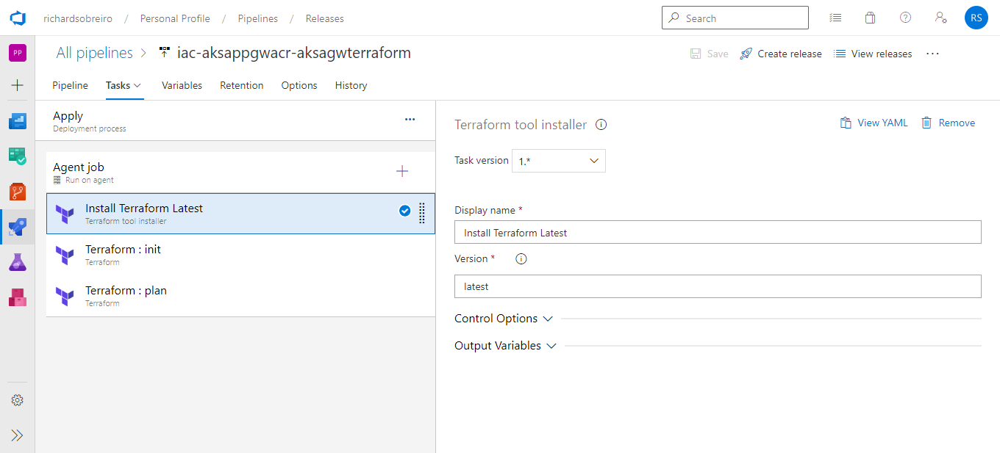

# How to Create Azure Kubernetes Service, Azure Application Gateway, and Azure Container Registry using Azure DevOps and Terraform

In this article, I'll describe the whole process for creating the following architecture using Azure DevOps and Terraform:


## Pre-Requisites

To debug this overall tutorial and get the most of it, it's nice to have the following tools installed in your local environment:

- [Helm 3](https://helm.sh/docs/intro/install/)
- [Terraform](https://developer.hashicorp.com/terraform/downloads)

Make sure to setup a Service Connection between an Azure Subscription and you Azure DevOps Project:

- [Azure DevOps Service Connection to Azure Portal Subscription](https://learn.microsoft.com/en-us/azure/devops/pipelines/library/connect-to-azure?view=azure-devops)
- When authenticated with a service principal, the app registration in Azure Active Directory requires one of the following application roles: Group.Read.All or Directory.Read.All


## Create the Azure Key Vault

[Here you will find all the steps required to create the Azure Key Vault Resource with the SSH Public Key secret and the self-signed certificate that will be used in the Application Gateway.](https://github.com/RichardSobreiro/iac-azurekeyvault-aksagwterraform)

Make sure to execute the following commands to store the SSH public key in Key Vault:

- Create the RSA certificate:
```
ssh-keygen \
-t rsa \
-b 4096 \
-C "100-days-linux-vm" \
-f ~/.ssh/100-days-linux-vm \
-N "$SSH_KEY_PASSWORD"
```

- Store the public key in variables:
```
SSH_PUBLIC_KEY=$(cat ~/.ssh/100-days-linux-vm.pub) && \
SSH_PRIVATE_KEY=$(cat ~/.ssh/100-days-linux-vm) && \
rm -rf ~/.ssh/100-days-linux-vm\*
```

- Set the secret value (assuming that az login was already executed):
```
az keyvault secret set \
--name "ssh-public-key" \
--vault-name "ric-eastus-all-kv-vault" \
--value "$SSH_PUBLIC_KEY" \
--output none
```

## The Terraform Code

The folder src/terraform holds all terraform files requited to create the infrastructure. For sake of simplicity (and also avoid getting to expensive in a simple tutorial). The gateway SKU used is Standard_v2:

- variables.tf
```
...
# Gateway
variable "app_gateway_sku" {
  description = "Application Gateway SKU."
  default = "Standard_v2"
}
...
```

Another important aspect is the roles required to deploy the resources. For sure, this is the trickier step. The file identity.tf is responsible for the creation of a managed identity:

- identity.tf
```
resource "azurerm_user_assigned_identity" "id" {
  resource_group_name = azurerm_resource_group.rg.name
  location            = azurerm_resource_group.rg.location

  name = "ric-id-k8s"

  tags = var.tags
}
```

This identity will be used as the Principal property for many role assignment resources being created in the role-assignment.tf file. 

- role-assignment.tf
```
...
resource "azurerm_role_assignment" "role_mgm_identity_contributor" {
  scope                = azurerm_application_gateway.agw.id
  role_definition_name = "Contributor"
  principal_id         = azurerm_user_assigned_identity.id.principal_id
  depends_on           = [azurerm_user_assigned_identity.id, azurerm_application_gateway.agw]
}

resource "azurerm_role_assignment" "role_mgm_identity_reader" {
  scope                = azurerm_application_gateway.agw.id
  role_definition_name = "Reader"
  principal_id         = azurerm_user_assigned_identity.id.principal_id
  depends_on           = [azurerm_user_assigned_identity.id, azurerm_application_gateway.agw]
}
...
```

The key to understand the overall architecture is that the managed identity is the identity used by the AGIC to perform changes on the App Gateway and on Kubernetes Cluster.

In this tutorial the Service Principal used by the Azure DevOps Service Connection has the Application.ReadWrite.All and Directory.Read.All permissions.

## Build Pipeline

The Build Pipeline is really simple. The only goal here is to publish the files and make them available for the Release Pipeline. [You can see the Build Pipeline output following this link](https://dev.azure.com/richardsobreiro/Personal%20Profile/_build?definitionId=26).

Following, the tasks used in the Build Pipeline are depicted in the pictures:

- Publish Terraform Files


- Publish Namespace Yaml Files


- Publish Ingress Yaml Files


## Release Pipeline

Given the artifacts created in [Build Pipeline](https://dev.azure.com/richardsobreiro/Personal%20Profile/_build?definitionId=26), the work on the Release Pipeline starts. [You can also see the Release Pipelie output following this link](https://dev.azure.com/richardsobreiro/Personal%20Profile/_release?_a=releases&view=all&definitionId=4).

Following we will detail each task present on it.

### Tasks

As already mentioned in the Key Vault deployment steps the terraform state is stored in an Azure Storage Account. Just make sure that you are using a diferent container from the Azure Key Vault terraform state:

- Install Terraform Latest



Settings:

> Version: latest

- Terraform : init


Settings:

> Provider: azurerm<br>
> Command: init<br>
> Configuration Directory: $(System.DefaultWorkingDirectory)/\_iac-aksappgwacr-aksagwterraform/terraform<br>
> AzureRM backend configuration: point to your Azure Storage Account Container<br>

- Terraform : plan


Settings:

> Provider: azurerm<br>
> Command: plan<br>
> Configuration Directory: $(System.DefaultWorkingDirectory)/\_iac-aksappgwacr-aksagwterraform/terraform<br>
> Azure subscription: point to your Azure Subscription<br>

- Terraform : apply


Settings:

> Provider: azurerm<br>
> Command: apply<br>
> Configuration Directory: $(System.DefaultWorkingDirectory)/\_iac-aksappgwacr-aksagwterraform/terraform<br>
> Azure subscription: point to your Azure Subscription<br>

- Terraform Outputs

After the execution of the apply command we will already got the AKS, AGW, and ACR deployed. Then, it's time to setup the environment variables necessary for the deployment of the Application Gateway Ingress Controller (AGIC). This task is responsible to read all the output parameters created by the apply command executed in the last task and create environment variables with the prefix TERRAFORM_OUTPUT_:


Settings:

> Path to Terraform scripts: \$(System.DefaultWorkingDirectory)/\_iac-aksappgwacr-aksagwterraform/terraform<br>
> Variable prefix: TERRAFORM_OUTPUT\_<br>

- Create: Namespaces

One of the great features offered by Kubernetes is the possibility of logically segregate PODs using namespaces. This task only demonstrates the creation of some default namespaces using a kubectl create command.


Settings:

> Service connection type: Azure Resource Manager<br>
> Azure subscription: point to your Azure Subscription<br>
> Resource group: \$(TERRAFORM_OUTPUT_resource_group_name)<br>
> Kubernetes cluster: ric-eastus-all-aks-k8s-01<br>
> Command: create (Enable _Use configuration_)<br>
> File path: \$(System.DefaultWorkingDirectory)/\_iac-aksappgwacr-aksagwterraform/namespaces/default-namescpaces.yaml<br>

- Create: AAD Pod Identity

AAD Pod Identity enables Kubernetes applications to access cloud resources securely with Azure Active Directory. Using Kubernetes primitives, administrators configure identities and bindings to match pods. Then without any code modifications, your containerized applications can leverage any resource in the cloud that depends on AAD as an identity provider.

We must also mention that AAD Pod Identity was deprecated a couple months and replaced by [Azude AD Workload Identity](https://azure.github.io/azure-workload-identity/docs/).


Settings:

> Service connection type: Azure Resource Manager<br>
> Azure subscription: point to your Azure Subscription<br>
> Resource group: \$(TERRAFORM_OUTPUT_resource_group_name)<br>
> Kubernetes cluster: ric-eastus-all-aks-k8s-01<br>
> Command: create (Disable _Use configuration_)<br>
> Arguments: -f https://raw.githubusercontent.com/Azure/aad-pod-identity/master/deploy/infra/deployment-rbac.yaml<br>

- Helm: Install Version 3.11.2


Settings:

> Helm Version Spec: 3.11.2

- Helm: Add ACR Repo


Settings:

> Azure subscription: point to your Azure Subscription<br>
> Script Location: Inline Script<br>
> Inline Script:
```
az acr helm repo add --name $(TERRAFORM_OUTPUT_container_registry_name) --username $(TERRAFORM_OUTPUT_container_registry_admin_username) --password $(TERRAFORM_OUTPUT_container_registry_admin_password)
```

- PowerShell: Add AGIC Repo


Settings:

> Type: Inline<br>
> Script:
```
helm repo add application-gateway-kubernetes-ingress https://appgwingress.blob.core.windows.net/ingress-azure-helm-package
helm repo update
```

- Tokenizer


Settings:

> Source Files Pattern: $(System.DefaultWorkingDirectory)/_iac-aksappgwacr-aksagwterraform/ingress/helm-config.yaml<br>
> Token Data Source: Environment Variables<br>

- Helm: Install AGIC

The last tasks are more straightforward and pre-requisites for the present task. After adding the AGIC helm repo and updating helm repos the _Tokenizer_ task replace the placeholders in the following patterns __[Property Name]__ by the output properties created by the apply command and used as inputs by the _Terraform Outputs_ task, which is responsible to transform them into environment variables.

After that, it's time to install the [Azure Application Gateway Ingress Controller](https://azure.github.io/application-gateway-kubernetes-ingress/setup/install-new/).


Settings:

> Service connection type: Azure Resource Manager<br>
> Azure subscription: point to your Azure Subscription<br>
> Resource group: \$(TERRAFORM_OUTPUT_resource_group_name)<br>
> Kubernetes cluster: ric-eastus-all-aks-k8s-01<br>
> Command: install<br>
> Chart Type: Name<br>
> Chart Name: application-gateway-kubernetes-ingress/ingress-azure<br>
> Version: 1.6.0<br>
> Value File: $(System.DefaultWorkingDirectory)/_iac-aksappgwacr-aksagwterraform/ingress/helm-config.yaml<br>
> Chart Type: Name<br>

###

## Build and Deploy the Helm Chart to Container Registry

To avoid reinventing the wheel every time a new POD needs to be deployed in the Kubernetes cluster we are making use of Helm to manage our Chart packages. [The source code for the Helm Chart used in this tutorial available at this link](https://github.com/RichardSobreiro/config-helmchart-dotnet6api).

[The output for the Helm Chart Build Pipeline can be visited at this link.](https://dev.azure.com/richardsobreiro/Personal%20Profile/_build/results?buildId=269&view=results)
Following we will talk about the Build Pipeline for the Helm Chart.

- Helm Install

The helm install taks is the used in the Azure Kubernetes Cluster release pipeline.

- Helm: Package

This task is responsible for creation of a .tgz file containing the Helm Pachage configuration files.


Settings:

> Command: Package<br>
> Chart Path: src/chart<br>
> Destination: $(Build.ArtifactStagingDirectory) **Enable the Save checkbox**<br>

- Azure CLI: Push Chart

After creating and saving the helm chart task in the local helm repo it's time to deploy it in our Azure Container Registry resource:


> Azure subscription: point to your Azure Subscription<br>
> Script Location: Inline Script<br>
> Inline Script:<br>
```
helm registry login riceastusallacrk8s.azurecr.io --username riceastusallacrk8s --password $(Release.Acr.Code)
helm push aspnetcore-1.0.0.tgz oci://riceastusallacrk8s.azurecr.io 
```
>> $(Release.Acr.Code) is the ACR password:


## Build .NET 6 API and deploy to Container Registry

The repo for the .NET 6 API won't be available because it's a simple API created using Visual Studio with docker deployment enabled.

[The output for the .NET 6 Rest API Build Pipeline can be visited at this link.](https://dev.azure.com/richardsobreiro/Personal%20Profile/_build/results?buildId=269&view=results)
Following we will talk about the Build Pipeline for the API.

- Docker: Build and Push

We are using a pre-configured azure pipeline task to build and push the docker image for the rest api.


Settings:

> Container registry: point to your Azure Container Registry Service Connection<br>
> Container repository: sampleapi<br>
> Command: buildAndPush<br>
> Dockerfile: Api/Api/Dockerfile<br>
> Build context: Api<br>
> Tags: $(Build.BuildNumber)<br>
>> Enable Add Pipeline metadata to image(s)<br>
>> Enable Add base image metadata to image(s)<br>

The container registry service connection details can also be seen in the following picture:


## Deploy .NET 6 API to AKS cluster

Finally, it's time to deploy a sample rest api in our cluster and see everything working together 

[Take a look at the Release Pipeline for the sample rest Api in this link.](https://dev.azure.com/richardsobreiro/Personal%20Profile/_releaseProgress?_a=release-pipeline-progress&releaseId=15) 

Following, the release pipeline for the sample application will be explained:

- File Creator: values.yaml


Settings:

> File path: values/values.yaml
> File Content:
```
namespace: __Release.Namespace__

environment: "__Release.Abbreviation__"

apphost: __Release.Host__

name: __Release.Image.Name__

container:
  pullPolicy: Always
  acr: __Release.Acr.Name__.azurecr.io
  image: __Release.Image.Name__
  tag: __Release.Image.Tag__
  port: 80
  probeurl: __Release.Container.ProbeUrl__
replicas: 1

ingress:
  backendpathprefix: "/"
  path: __Release.App.Path__
  sslcertificate: "__Release.CertName__"
```

- Tokenizer

Just pay attention to the Source Files Pattern propety value.


- Helm: Install 3.11.2

Same as the in the previous release pipeline for AKS and AGW infrastructure.

- Azure CLI: Az Acr Helm Repo Add


Settings:

> Azure subscription: point to your Azure Subscription<br>
> Script Location: Inline Script<br>
> Inline Script: 
```
az acr helm repo add --n $(Release.Acr.Name)
helm registry login $(Release.Acr.Name).azurecr.io --username $(Release.Acr.Name) --password $(Release.Acr.Code)
az aks install-cli
az aks get-credentials --resource-group $(Release.Aks.ResourceGroup) --name $(Release.Aks.Name)
helm upgrade --namespace $(Release.Namespace) --install --reset-values --force --values values/values.yaml $(Release.Chart.AspNetCore)-$(Release.Image.Name) oci://$(Release.Acr.Name).azurecr.io/$(Release.Chart.AspNetCore) --version 1.0.0
```

## Login to AKS Cluster and See Results

In your command line tool run the following commands to see the PODs running in our Cluster:

```
az login
az aks get-credentials --resource-group ric-eastus-all-rg-k8s --name ric-eastus-all-aks-k8s-01
kubectl get pods --all-namespaces
```


In the azure portal we can also get the results:


Finally, using the application gateway URL navigate to the health check path:

```
https://ric-eastus-all-k8s.eastus.cloudapp.azure.com/healthz
```


### Troubleshooting

**You need to have Helm 3 and Azure CLI installed before starting a troubleshoot proccess.**

_Don't forget to run az login and az aks get-credentials before the following commands._

Usually, the permissions assigned to the Managed Identity are the most common cause for problems during the AGIC start up phase. To dive deeper into details use the following commands:

```
kubectl describe pods [Pod name] -n default
kubectl logs [Pod name] -n default
```

Maybe it's also nice to setup the AGIC from the local environment to avoid the long execution time that the release pipeline needs. For that, use the helm delete and helm install commands to speed up the debug process:

- Delete Helm Release for AGIC

```
helm delete ingress-azure
```

- Intall AGIC

The commands helm repo add and helm repo update must be executed only once.

```
helm repo add application-gateway-kubernetes-ingress https://appgwingress.blob.core.windows.net/ingress-azure-helm-package
helm repo update
helm install ingress-azure -f helm-config.yaml application-gateway-kubernetes-ingress/ingress-azure --version 1.6.0
```

Troubleshooting AGIC: https://azure.github.io/application-gateway-kubernetes-ingress/troubleshootings/

